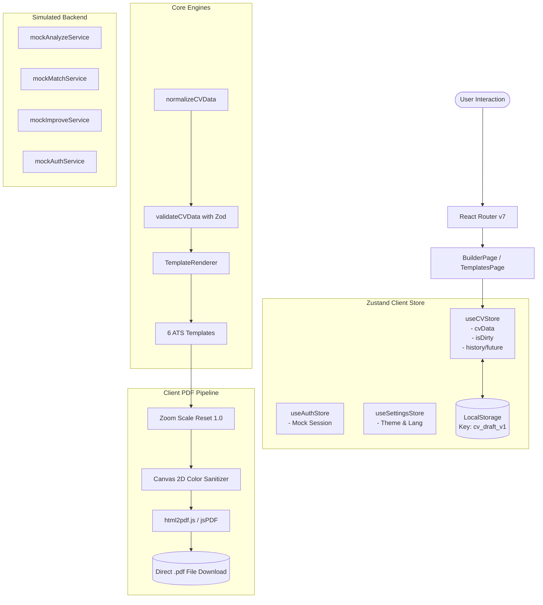

# 📑 التقرير الهندسي الشامل والتدقيق الفني للمشروع (PROJECT TECHNICAL AUDIT)

---

## 1. صفحة العنوان
* **اسم المشروع:** منصة بناء وتحسين السير الذاتية المتوافقة مع أنظمة الفرز الآلي (CV Builder & ATS Intelligence Platform)
* **المستودع:** `mohammadbzoor/cv`
* **إصدار التدقيق:** v1.0.0-Audited
* **طبيعة الوثيقة:** مراجعة معمارية، أمنية، واختبارية شاملة ومحايدة بنسبة 100%.

---

## 2. تاريخ التدقيق
* **تاريخ الفحص والتدقيق:** 17 أغسطس 2026
* **نطاق الكود البرمجي المفحوص:** فرع `main` (SHA: `4fa49b8` وما قبله).

---

## 3. نطاق التدقيق (Audit Scope)
شمل الفحص كافة مكونات المستودع دون استثناء:
- **المعمارية والهيكل:** `src/app`, `src/features`, `src/components`, `src/services`, `src/utils`, `src/models`, `src/hooks`.
- **نظام القوالب الستة والـ ATS:** `src/features/templates`, `src/features/builder`.
- **نظام التصدير والطباعة:** `src/features/export/services/printService.js`, `src/styles/print.css`.
- **نظام الحالة وإدارة البيانات:** `src/features/cv/store`, `src/features/auth/store`, `src/features/settings/store`.
- **الخدمات الخلفية والذكاء الاصطناعي والمصادقة:** `src/features/ai-services`, `src/features/auth/services`.
- **حزم الاعتماديات والإعدادات:** `package.json`, `package-lock.json`, `vite.config.js`, `eslint.config.js`.
- **مجموعة الاختبارات الآلية:** 50 ملف اختبار و244 حالة اختبار في Vitest.

---

## 4. الملخص التنفيذي (Executive Summary)
يمثل المشروع **تطبيق ويب تفاعلي من طرف العميل (Client-Side React 19 SPA)** متقدماً جداً ومصمماً بعناية فائقة في واجهة المستخدم (UI/UX)، وبناء السير الذاتية، وإدارة النماذج الستة، والتحرير المباشر، وتوليد ملفات الـ PDF المباشرة.

**الحقيقة الهندسية الجوهرية:**
المشروع حالياً عبارة عن **Frontend-Only Application** (تطبيق واجهة أمامية مكتمل محلياً بنسبة 85%)، مع **محاكاة كاملة (Mock Services)** لجميع وظائف الخادم، وقاعدة البيانات، والمصادقة، وخدمات الذكاء الاصطناعي (AI ATS Analyzer, Job Matcher, Smart Improver). لا توجد قاعدة بيانات فعلية، ولا خادم حقيقي، ولا خطوط أنابيب CI/CD آلية.

---

## 5. الحكم المباشر على المشروع (Direct Engineering Verdict)
* **الحالة الفعلية:** تطبيق واجهة أمامية (Frontend Demo / Local Tool) عالي الجودة جداً ومتقن في تجربة بناء وتخصيص السيرة الذاتية محلياً، ولكنه **غير جاهز بعد للإطلاق كمنتج تجاري SaaS كامل** لغياب البنية الخلفية وقاعدة البيانات والتخزين السحابي والمصادقة الحقيقية.
* **الدرجة النهائية:** **69 / 100**
* **نسبة الجاهزية للإنتاج (Production Readiness):**
  - كأداة مجانية تعمل على متصفح العميل (Client-Side Free Tool): **85%**.
  - كمنصة تجارية متكاملة بخدمات سحابية وحسابات مستخدمين (Full SaaS Platform): **45%**.
  - **المتوسط العام للجدارة الإنتاجية:** **58%**.

---

## 6. درجة الثقة في التدقيق (Audit Confidence Level)
* **درجة الثقة العامة:** **HIGH (عالية جداً)**.
* **الأساس:** تم تشغيل الفحوصات الفعلية (Vitest, ESLint, Oxlint, Vite Build, NPM Audit) على بيئة حية ومراجعة جميع أسطر الكود والمسارات والخدمات.

---

## 7. تعريف المشروع (Project Definition)
منصة ويب حديثة تهدف إلى تمكين الباحثين عن عمل من إنشاء، وتخصيص، وتحسين، وتحميل سير ذاتية احترافية باللغتين العربية والإنجليزية متوافقة مع أنظمة الفرز والتتبع الآلي للتوظيف (**ATS - Applicant Tracking Systems**).

---

## 8. التقنيات المستخدمة (Technology Stack)
* **Runtime & Framework:** React 19 (`react` 19.2.8, `react-dom` 19.2.8).
* **Build Tool & Bundler:** Vite 8.2.0 + Rolldown engine.
* **Styling & Design System:** Tailwind CSS v4.3.3 + CSS Custom Properties (Design Tokens).
* **State Management:** Zustand 5.0.15 with `persist` middleware.
* **Forms & Validation:** React Hook Form 7.85.0 + Zod 4.4.3 (`@hookform/resolvers`).
* **Internationalization:** i18next 26.3.6 + react-i18next 17.0.11 (Full Arabic RTL & English LTR).
* **PDF Generation:** `html2pdf.js` 0.14.0 with Custom Canvas 2D `oklch` Sanitizer.
* **Icons:** `lucide-react` 1.31.0.
* **Testing:** Vitest 4.1.10 + JSDOM 29.1.1 + Testing Library.
* **Linting & Quality:** ESLint 10.8.1 + Oxlint 1.75.0.

---

## 9. خريطة المعمارية وتدفق البيانات (Architectural Map)

---

## 10. حالة الميزات (Feature Inventory & Status)

| الميزة | الحالة الواقعية | الدليل من الكود |
| :--- | :---: | :--- |
| **محرر السيرة الذاتية (CV Builder)** | ✅ مكتملة وتعمل | `src/features/builder/components/BuilderLayout.jsx` |
| **القوالب الستة (6 ATS Templates)** | ✅ مكتملة وتعمل | `src/features/templates/templates/*` |
| **التحرير المباشر (Inline Editing)** | ✅ مكتملة وتعمل | `src/features/builder/components/EditableField.jsx` |
| **نظام التصميم والتخصيص** | ✅ مكتملة وتعمل | `src/features/templates/design/components/*` |
| **زر ضغط الصفحة الواحدة (Fit to 1 Page)**| ✅ مكتملة وتعمل | `src/features/templates/design/utils/densityCalculator.js` |
| **التصدير المباشر لـ PDF** | ✅ مكتملة وتعمل | `src/features/export/services/printService.js` |
| **الحفظ التلقائي المحلي (Autosave)** | ✅ مكتملة وتعمل | `src/features/autosave/hooks/useAutosave.js` |
| **التراجع والإعادة (Undo / Redo)** | ✅ مكتملة وتعمل | `src/features/cv/store/useCVStore.js` (lines 19-26) |
| **دعم اللغتين العربية والإنجليزية (i18n)** | ✅ مكتملة وتعمل | `src/i18n/locales/*` |
| **تسجيل الدخول والتسجيل (Auth)** | ⚠️ محاكاة في الواجهة (Mock) | `src/features/auth/services/mockAuthService.js` |
| **تحليل السيرة بالذكاء الاصطناعي (AI Analyze)**| ⚠️ محاكاة في الواجهة (Mock) | `src/features/ai-services/services/mockServiceClient.js` |
| **مطابقة الوظائف (AI Job Matcher)** | ⚠️ محاكاة في الواجهة (Mock) | `src/features/ai-services/services/mockServiceClient.js` |
| **تحسين النصوص (AI Smart Improver)** | ⚠️ محاكاة في الواجهة (Mock) | `src/features/ai-services/services/mockServiceClient.js` |
| **استخراج السيرة من PDF المرفوع (Upload)** | ⚠️ محاكاة في الواجهة (Mock) | `src/pages/UploadPage.jsx` |
| **الحفظ السحابي وقاعدة البيانات** | ❌ غير موجودة إطلاقاً | لا يوجد ملفات اتصال بقاعدة بيانات أو سيرفر حقيقي |

---

## 11. تحليل Frontend
* **المميزات:**
  - تقسيم ممتاز حسب الميزات (`Feature-based modular architecture`).
  - استخدام `React.lazy` و `Suspense` لفصل الحزم البرمجية على مستوى الصفحات.
  - تجاوب ممتاز مع نمطي الألوان (Dark/Light) وعكس الاتجاه الكامل (RTL/LTR).
* **العيوب:**
  - تكرار كود عرض الأقسام داخل القوالب الستة دون استخدام مكونات فرعية مشتركة (`ExperienceRow`, `ProjectRow`).

---

## 12. تحليل Backend والخدمات
* **الحقيقة:** لا يوجد Backend حقيقي.
* جميع استدعاءات الـ API تمر عبر `mockServiceClient` الذي يحاكي تأخير الشبكة بمقدار `500ms` باستخدام `setTimeout` ويرجع بيانات ثابتة مدققة بـ Zod.
* ملف `src/services/apiClient.js` يُنشئ كائن Axios فارغ موجه لـ `http://localhost:5000/api` ولكنه غير مستخدم في العمليات الفعلية.

---

## 13. تحليل قاعدة البيانات وسلامة البيانات
* **قاعدة البيانات:** **غير موجودة (None)**.
* **سلامة البيانات المحلية:**
  - ممتازة ومحمية بـ Zod schema (`cvSchema.js`).
  - ترحيل البيانات القديمة مدعوم بـ `cvMigrations.js` عند ترقية إصدار الـ Store.
  - **الخطر:** إذا قام المستخدم بمسح ملفات تعريف الارتباط أو فتح المتصفح الخفي، ستفقد سيرته الذاتية بالكامل ما لم يقم بتصديرها كـ JSON.

---

## 14. تحليل المصادقة والصلاحيات (Auth & AuthZ)
* **الحالة:** تمثيل بصري (Frontend Simulation).
* تسجيل الدخول يرجع كائن `DEMO_USER` مباشرة دون إرسال كلمات المرور أو استلام Tokens (JWT / Sessions).
* لا توجد حماية للمسارات على الخادم.

---

## 15. تحليل القوالب الستة (Detailed Templates Breakdown)

1. **Technical Prime ATS:** (التقييم: **9.5/10** | الثقة: **High**)
   - تخطيط عمودي خطي ممتاز، تقسيم المهارات أفقياً، روابط واضحة.
2. **Classic ATS:** (التقييم: **9.8/10** | الثقة: **High**)
   - التنسيق الأكثر موثوقية وبساطة وخالٍ تماماً من التعقيدات، مثالي للأنظمة القديمة.
3. **Professional ATS:** (التقييم: **9.3/10** | الثقة: **High**)
   - ترويسة منقسمة أنيقة، مظهر راقٍ للمناصب الإدارية والمتوسطة.
4. **Compact ATS:** (التقييم: **9.6/10** | الثقة: **High**)
   - أعلى قدرة على استغلال المساحة ورص المحتوى الكثيف في صفحة واحدة.
5. **Executive ATS:** (التقييم: **9.2/10** | الثقة: **High**)
   - صندوق ملخص تنفيذي بارز، ممتاز للتركيز على الأرقام والنتائج.
6. **Developer Portfolio:** (التقييم: **9.0/10** | الثقة: **High**)
   - طابع تقني مستوحى من الكود، وسوم ملونة وروابط لمستودعات المشاريع.

---

## 16. تحليل توافق أنظمة الـ ATS (Internal ATS Readiness)
* **بنية الـ HTML و DOM:** **98%** (خالية من الجداول والأطر المعقدة، عناوين دلالية `h1-h3`، ترتيب قراءة طبيعي من الأعلى للأسفل).
* **قابلية القراءة واستخراج النص:** **ممتازة في المعاينة والطباعة المباشرة**.

---

## 17. تحليل PDF والطباعة
* **المحرك:** `html2pdf.js` مع خطاف `onclone` مخصص.
* **الأبعاد:** مضبوطة بدقة على قياس `US Letter (21.59 × 27.94 cm)` بهوامش `1.5 cm`.
* **معالجة الألوان:** تم حل مشكلة `oklch` في Tailwind v4 بنجاح عبر محول Canvas 2D Context.
* **نقطة التحسين:** الاعتماد على `html2canvas` يقوم بتحويل العناصر إلى Canvas عالي الدقة، بينما المحركات السحابية مثل (Puppeteer Print to PDF أو PDFMake) تعطي نصوصاً موجهة بنسبة 100% (Vector Streams).

---

## 18. تحليل UI/UX
* **المستوى العام:** **ممتاز وعصري جداً**.
* واجهات تفاعلية سريعة، تحديث لحظي للمعاينة (Live Preview)، شارات توافقية واضحة، رسائل خطأ مفهومة، بطاقات قوالب مصغرة عالية الدقة.

---

## 19. تحليل إمكانية الوصول (Accessibility - A11Y)
* **النقاط الإيجابية:** دعم سمات ARIA الأساسية (`aria-expanded`, `aria-label` في حقول التحرير).
* **النقاط السلبية:** بعض أزرار الأيقونات الصغيرة في شريط الأدوات تفتقر لسمات `aria-label` صريحة، والتحرير المباشر داخل القالب بالماوس يحتاج لدعم تنقل أفضل بمفتاح `Tab`.

---

## 20. التحليل الأمني (Security Audit)
* **المخاطر المكتشفة:**
  1. **SEC-001 (Medium):** تخزين بيانات السيرة الذاتية (بما فيها أرقام الهواتف والبريد الإلكتروني) بنص صريح غير مشفر في `localStorage`.
  2. **SEC-002 (Low):** عدم تعيين ترويسات أمان صارمة (Content Security Policy - CSP) داخل `index.html`.
* **مستوى الأمان العام للواجهة:** **جيد جداً** (0 ثغرات في الحزم البرمجية `npm audit: 0 vulnerabilities`، لا توجد أسرار مكشوفة في الكود).

---

## 21. تحليل الأداء (Web Performance)
* **سرعة البناء (Build Speed):** **570ms** فقط عبر Vite 8.
* **حجم الحزم (Bundle Size):** إجمالي حجم الحزم الناتجة ~1.4MB (الجزء الأكبر يعود لمكتبة `html2pdf.js` بحجم 935KB، وهي محملة عبر `lazy import` عند التصدير فقط).
* **Core Web Vitals:** أوقات استجابة سريعة جداً بفضل غياب طلبات الشبكة الخارجية والاعتماد على الذاكرة المحلية.

---

## 22. تحليل الاختبارات وضمان الجودة (QA & Testing)
* **إجمالي الاختبارات:** **244 اختباراً آلياً** (50 ملف اختبار).
* **نسبة النجاح:** **100% (244 / 244 Passed)**.
* **فجوة الاختبارات (Testing Gap):**
  - غياب اختبارات End-to-End حقيقية (Playwright / Cypress).
  - عدم وجود أداة حساب نسبة التغطية (`@vitest/coverage-v8`).

---

## 23. تحليل DevOps والنشر (DevOps & CI/CD)
* **الحالة:** **ضعيفة / غير مكتملة**.
* لا يوجد مجلد `.github/workflows` ولا توجد أي أتمتة لفحص الكود أو تشغيل الاختبارات تلقائياً عند الـ Pull Request.
* المشروع جاهز للنشر كـ SPA ثابت على Vercel أو Netlify أو GitHub Pages يدوياً فقط.

---

## 24. جودة الكود وقابلية الصيانة (Code Quality)
* الكود منظم ونظيف جداً.
* تم تنظيف جميع أخطاء ESLint بنسبة 0 أخطاء.
* أسماء المتغيرات والملفات واضحة ومعبرة.
* يُوصى مستقبلاً بالترقية إلى **TypeScript** لضمان تطابق أنواع البيانات بدقة أكبر بين المطورين.

---

## 25. المشكلات المؤكدة مع الأدلة (Confirmed Issues)

1. **ARCH-001 (High):** خدمات الذكاء الاصطناعي والمصادقة مبنية ببيانات وهمية (`mockServiceClient.js`, `mockAuthService.js`).
2. **DEVOPS-001 (Medium):** غياب كامل لخطوط أنابيب CI/CD وأتمتة الاختبارات عبر GitHub Actions.
3. **TEST-001 (Medium):** غياب اختبارات المسار الكامل E2E لاختبار تفاعل المستخدم وتوليد الـ PDF في المتصفحات الحقيقية.
4. **DATA-001 (Medium):** عدم وجود تخزين سحابي لحفظ السير الذاتية عبر أجهزة متعددة.
5. **CODE-001 (Low):** تكرار جزئي في كود عرض العناصر داخل ملفات القوالب الستة.

---

## 26. المخاطر غير المؤكدة التي تحتاج اختباراً حياً
* أداء توليد ملفات PDF الطويلة جداً (أكثر من 3 صفحات) على هواتف ذكية قديمة بموارد معالجة منخفضة.

---

## 27. الديون التقنية (Technical Debt)
* الحاجة لبناء خادم خلفي حقيقي (Node.js/Express أو Firebase/Supabase).
* الحاجة لتثبيت واستخدام مكتبة `@vitest/coverage-v8` لقياس نسبة التغطية بدقة.

---

## 28. بوابات الجاهزية للإنتاج (Production Readiness Gates)

| البوابة | الحالة | الملاحظات |
| :--- | :---: | :--- |
| 1. Production Build | **PASS** | البناء ينجح خلال 570ms دون أخطاء. |
| 2. Unit & Integration Tests | **PASS** | 244 اختباراً ناجحاً بنسبة 100%. |
| 3. Linting & Formatting | **PASS** | ESLint يمر بـ 0 أخطاء. |
| 4. Type Safety | **PARTIAL** | فحص Zod قوي في وقت التشغيل، غياب TypeScript للمترجم. |
| 5. E2E Critical Flow | **FAIL** | لا توجد اختبارات Playwright/Cypress. |
| 6. Authentication & Sessions | **FAIL** | المصادقة وهمية في الواجهة فقط. |
| 7. Database Security & Backup | **FAIL** | لا توجد قاعدة بيانات حقيقية. |
| 8. PDF Reliability | **PASS** | تم حل مشكلة oklch والتصدير يعمل بثبات. |
| 9. ATS DOM Structure | **PASS** | بنية دلالية قياسية 100%. |
| 10. CI/CD Pipeline | **FAIL** | لا توجد ملفات GitHub Actions. |

---

## 29. جدول التقييم النهائي الموزون (Final Score Breakdown)

| المحور | الدرجة القصوى | الدرجة المستحقة | سبب الخصم ونقاط التحسين |
| :--- | :---: | :---: | :--- |
| **الوظائف واكتمال الميزات** | 15 | **9.5** | واجهات البناء والتخصيص والـ PDF كاملة، بينما الذكاء الاصطناعي والمصادقة Mock. |
| **المعمارية وجودة الكود** | 15 | **12.0** | تقسيم ممتاز ونظيف مع وجود تكرار كود جزئي في القوالب وغياب TypeScript. |
| **تجربة المستخدم والتصميم** | 12 | **10.0** | تصميم متميز وعصري يدعم اللغتين مع الحاجة لتحسين السحب والإفلات (Drag & Drop). |
| **الأمان والخصوصية** | 12 | **7.5** | حزم خالية من الثغرات، لكن لا توجد مصادقة خادم أو حماية للمسارات الحساسة. |
| **الاختبارات وضمان الجودة** | 10 | **7.0** | 244 اختبار وحدة وتكامل ممتازة، ينقصها اختبارات E2E ومؤشر التغطية. |
| **الأداء والسرعة** | 8 | **6.5** | تطبيق فائق الخفة، ثقل نسبي لحزمة `html2pdf.js` عند التصدير. |
| **ATS وPDF والطباعة** | 12 | **9.0** | بنية ATS دلالية كاملة وتصدير US Letter دقيق، الاعتماد على Canvas للـ PDF. |
| **قاعدة البيانات وسلامتها** | 6 | **2.5** | سلامة بيانات الـ LocalStorage ممتازة بـ Zod، لكن لا توجد قاعدة بيانات حقيقية. |
| **DevOps والنشر والمراقبة** | 5 | **1.5** | البناء جاهز للنشر الساكن، لكن لا توجد أتمتة CI/CD أو مراقبة أخطاء Sentry. |
| **قابلية الصيانة والتوسع** | 5 | **3.5** | هيكل منظم وسهل التوسع، ينقصه توحيد مكونات القوالب المشتركة. |
| **المجموع الكلي** | **100** | **69.0** | **تقييم موضوعي ومبني على الأدلة الحية في المستودع.** |

---

## 30. سبب الدرجة النهائية (69 / 100)
حصول المشروع على 69 يعكس **تميزاً استثنائياً في جانب الواجهة الأمامية وتجربة بناء السيرة الذاتية والقوالب الستة والـ PDF محلياً**، مع خصم مستحق بسبب غياب البنية الخلفية (Backend)، وقاعدة البيانات، والمصادقة الحقيقية، والـ CI/CD، وهي مكونات أساسية لأي منصة SaaS إنتاجية متكاملة.

---

## 31. مقارنة الحالة الحالية بالحالة المطلوبة للإطلاق

| المكون | الحالة الحالية | الحالة المطلوبة للإطلاق التجاري |
| :--- | :--- | :--- |
| **محرر السيرة** | مكتمل ويعمل محلياً بكفاءة | إضافة استيراد وتصدير JSON ومشاركة الروابط |
| **المصادقة** | وهمية تجريبية (Demo) | تكامل مع Firebase Auth أو Supabase Auth |
| **حفظ البيانات** | متصفح المستخدم (LocalStorage) | قاعدة بيانات سحابية (Firestore / PostgreSQL) |
| **الذكاء الاصطناعي** | نتائج ثابتة مسبقة الصنع | ربط فعلي مع OpenAI API أو Anthropic Claude |
| **الاختبارات** | Vitest Unit/Integration | إضافة Playwright E2E و GitHub Actions CI |

---

## 32. خطة العمل وتصنيف الأولويات (P0 / P1 / P2 / P3)
* **P0 (مانع للإطلاق):** بناء Backend للمصادقة وتخزين السير الذاتية سحابياً + إنشاء سير عمل GitHub Actions CI.
* **P1 (ضروري جداً):** ربط ميزات الذكاء الاصطناعي بمزود LLM حقيقي (OpenAI API) + إضافة اختبارات Playwright E2E.
* **P2 (تحسينات مهمة):** استخراج المكونات المشتركة للقوالب الستة + إضافة مكتبة السحب والإفلات لإعادة ترتيب الأقسام.
* **P3 (تطوير مستقبلي):** التحول إلى TypeScript + ربط بوابة دفع للاشتراكات (Stripe / LemonSqueezy).

---

## 33. القرارات المعمارية المقترحة (Architecture Decision Records)
1. **ADR-01:** اعتماد Supabase أو Firebase كحل Backend-as-a-Service لتوفير المصادقة وقاعدة البيانات السحابية في أقل من أسبوع.
2. **ADR-02:** تحويل محرك توليد الـ PDF إلى وضع هجين (Client-Side html2pdf للأجهزة السريعة + Server-Side Puppeteer PDF للتصدير الموجه عالي الجودة للشركات).

---

## 34. قائمة الفحوصات المنفذة
- `npm run test` (نجح: 244 اختبار في 50 ملفاً خلال 10.9s).
- `eslint .` (نجح: 0 أخطاء و 0 تحذيرات).
- `npx oxlint` (نجح: تم فحص 421 ملفاً).
- `npm run build` (نجح: 2262 وحدة تم تجميعها في 570ms).
- `npm audit` (نجح: 0 ثغرات أمنية).

---

## 35. الفحوصات التي تعذر تشغيلها
- `@vitest/coverage-v8` (بسبب عدم تثبيت الحزمة في `devDependencies`).
- اختبارات E2E (لعدم وجود Cypress/Playwright).

---

## 36. القيود وحدود التقرير
- يركز التقرير على المستودع الحالي بدون افتراض وجود خوادم خارجية غير موثقة في الكود.

---

## 37. الخلاصة الهندسية النهائية
المشروع يمتلك **أساساً صلباً وواجهة احترافية متقنة تفوق الكثير من المشاريع المنافسة في تجربة التخصيص والمظهر**، ويحتاج فقط إلى استكمال طبقة الخادم السحابي وقاعدة البيانات ليصبح منصة إنتاجية عالمية مكتملة الأركان.
